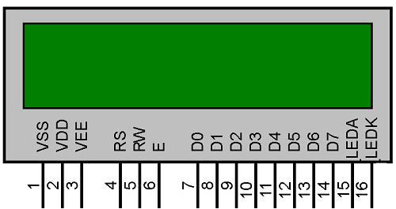

# Alpha Numeric LCD serial Interface 



##### Description:
 - In general, the alphanumeric LCD displays have 8 data lines and 3 control pins, if you have to connect these displays to your microcontroller project we required min 6 pins ( 4-bit mode + rs and enable)
 - For reduce the pins required to interface LCD, Here we use a one extra microcontroller ATMEGA32 (Arduino Uno), ATMEGA16, ATMEGA8 can be used 
 - This extra microcontroller has connected to LCD with 4-bit data mode interface and interface with other microcontroller using TTL/serial interface, means this microcontroller acts like more mediate between the LCD and other Microcontroller for reducing interface pins
 - The code is written using Arduino IDE 
 - This code provided a very basic frame format and fewer features
 - Futures will be added later

##### Frame format
   - The serial frame format to display the required string on display is 

   - ``` [LCD-CORDINATES(coloumrow)] [WHITESPACE] [DATA] ```
   - LCD cordinates means if its 16x2 lcd then the row and coloum number starts from 1
   - __EXAMPLE__
       -  To display hello world on 16x2 LCD from the second row from 3rd color onward
       - we have to send ``` 32 hello world``` to serial (first column number next without space row number)
       - Presently they ae many bugs and lacks of features in this code will update the futures later